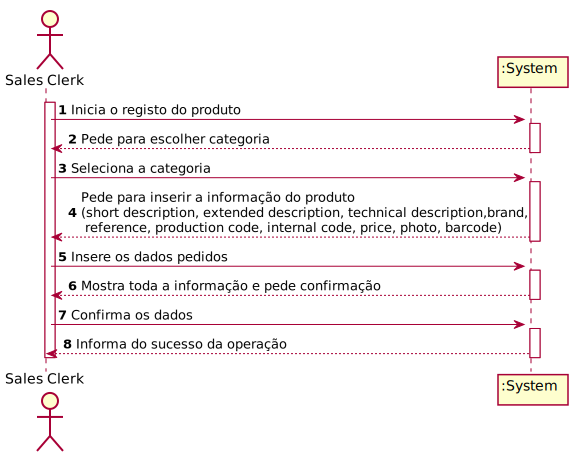

# US1001

# 1. Requirements engineering

### Brief format
The Sales Clerk wants to specify a product.
The system asks to choose the category.
The Sales Clerk chooses the category.
The system asks to insert the data about the product
The Sales Clerk inserts the data.
The system requests for confirmation
The Sales Clerk confirms.
The system display all the data about the product and informs the Sales Clerk about the success of the operation.

## 1.1. Relevant questions on the forum

> Q: Does the project support more than 1 currency, and if so which currencies should it support?
>
> A: Yes! The project must be prepared to easily support several currencies.
The system should work adopting a base currency (e.g.: EUR) and, according to the customer location, be able to present prices on other currencies (e.g. USD) using an external currency converter.
During the prototype development, using a currency converter should not be a major concern.
> 
>---
>
> Q: Are the internal code, production code and reference generated or entered?
>
> A: That information is all entered/typed by the user.
>
>---
>
> Q: The development team wonders whether in a product registration the attributes "photo", "internal code", "short description", "extended description", "technical description", "brand", "reference", "production code" are mandatory and how big they are?
>
> A: Some information regarding each of those attributes:
>
>- photo: it might be of any common format (e.g. png, jpeg, svg);
>
>- short description: not empty having 30 chars maximum;
>
>- extended description: not empty with a minimum of 20 chars and 100 chars maximum;
>
>- technical description: multiple lines of text, preferably with no limit or the biggest possible.
>
>- brand: not empty having 50 chars maximum;
>
>- reference: not empty alphanumeric code with at 23 chars maximum;
>
>- production code: not empty alphanumeric code with at 23 chars maximum however it might meet a given regular expression defined/configured at deployment time.
>
>- internal code: not empty alphanumeric code with at 23 chars maximum however it might meet a given regular expression defined/configured at deployment time.
>
>
>Mandatory attributes: internal code, short and extended description.
>
>In accordance with the specification document, other atributes might also be mandatory.
>
>---
>
> Q1:About the photo in the product, we would like to know how it is associated to the product.
>
>Q2:Should we write the path to it, or should a window open to import the photo into the program? 
> 
> A:
From a usability perspective, it would be better having a window (or any other way) to select the photo file to be uploaded.
>
>However, if by some reason that option is not viable by now the user can write the path but the system must validate it.
>
> 
# 2. OO Analysis

*Neste secção a equipa deve relatar o estudo/análise/comparação que fez com o intuito de tomar as melhores opções de design para a funcionalidade bem como aplicar diagramas/artefactos de análise adequados.*

*Recomenda-se que organize este conteúdo por subsecções.*

## Excerpt from the Relevant Domain Model for US

## 2.1. System Sequence Diagram

# 3. Design - User Story Realization

*Nesta secção a equipa deve descrever o design adotado para satisfazer a funcionalidade. Entre outros, a equipa deve apresentar diagrama(s) de realização da funcionalidade, diagrama(s) de classes, identificação de padrões aplicados e quais foram os principais testes especificados para validar a funcionalidade.*

*Para além das secções sugeridas, podem ser incluídas outras.*

## 3.1. Sequence Diagram

## 3.2. Class Diagram

## 3.3. Padrões Aplicados

*Nesta secção deve apresentar e explicar quais e como foram os padrões de design aplicados e as melhores práticas.*

## 3.4. Tests
*Nesta secção deve sistematizar como os testes foram concebidos para permitir uma correta aferição da satisfação dos requisitos.*

**Teste 1:** Verificar que não é possível criar uma instância da classe Exemplo com valores nulos.

	@Test(expected = IllegalArgumentException.class)
		public void ensureNullIsNotAllowed() {
		Exemplo instance = new Exemplo(null, null);
	}

# 4. Implementação

*Nesta secção a equipa deve providenciar, se necessário, algumas evidências de que a implementação está em conformidade com o design efetuado. Para além disso, deve mencionar/descrever a existência de outros ficheiros (e.g. de configuração) relevantes e destacar commits relevantes;*

*Recomenda-se que organize este conteúdo por subsecções.*

# 5. Integração/Demonstração

*Nesta secção a equipa deve descrever os esforços realizados no sentido de integrar a funcionalidade desenvolvida com as restantes funcionalidades do sistema.*

# 6. Observações

*Nesta secção sugere-se que a equipa apresente uma perspetiva critica sobre o trabalho desenvolvido apontando, por exemplo, outras alternativas e ou trabalhos futuros relacionados.*

