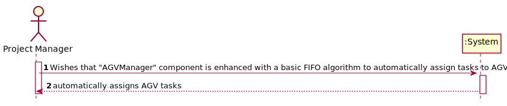

# US4002
=======================================

# 1. Requirements engineering

### Brief format
As Project Manager, I wishes that "AGVManager" component is enhanced with a basic FIFO algorithm to automatically assign tasks to AGVs and the system automatically assigns AGV tasks.
## 1.1. Relevant questions on the forum

> Q: In US4002 it is required that the AGV Manager should support automatic assignment of orders to AGVs. In US2003 the Warehouse Employee will be able to assign any order to an AGV available. If the orders are being automatically assigned to an AGV (US4002) how can the Warehouse Employee assign a specific order to an AGV?
>
> A: Usually, and by default, one intends that system automatically assigns orders to AGVs (US 4002).
>
>However, if such option is not available (e.g.: turned off) or by some reason an order needs to be prepared faster than it would normally be, the warehouse employee has the ability to assign tasks manually (US 2003).
>
>Notice that, orders that can be prepared by AGVs are being added to a queue following a FIFO algorithm (part of the US 4002). In the scope of US 2003 the FIFO algorithm does not apply... the employee might choose the order (s)he wants.
>
>---
>
> Q: Will the FIFO algorithm be used to control the tasks/orders that are waiting for an available AGV? If I am interpreting something wrong please clarify for me.
>
> A: The general idea is that product orders reaching a certain state whose meaning is of "need to be prepared by an AGV" are added to a queue. Then, following the FIFO algorithm orders are removed from the queue and assigned to available AGVs capable of performing the task that such order implies.
>
>---
>
> Q:Talking about being automatic, the System executes this functionally after some other functionality, or executes it periodically? If it is periodically, how often?
>
> A: Teams are free to propose a solution for that problem/issue. Notice that all team decisions must be well supported in light of business need and technical constraints.

# 2. OO Analysis

*Neste secção a equipa deve relatar o estudo/análise/comparação que fez com o intuito de tomar as melhores opções de design para a funcionalidade bem como aplicar diagramas/artefactos de análise adequados.*

*Recomenda-se que organize este conteúdo por subsecções.*

## 2.1. System Sequence Diagram

# 3. Design - User Story Realization

*Nesta secção a equipa deve descrever o design adotado para satisfazer a funcionalidade. Entre outros, a equipa deve apresentar diagrama(s) de realização da funcionalidade, diagrama(s) de classes, identificação de padrões aplicados e quais foram os principais testes especificados para validar a funcionalidade.*

*Para além das secções sugeridas, podem ser incluídas outras.*

## 3.1. Sequence Diagram

## 3.2. Class Diagram

## 3.3. Padrões Aplicados
*Use the standard layer-based application framework*

        Domain Class: AGV
        Controller: AutomaticTaskController
        Repository: AutomaticTaskRepository

## 3.4. Testes 
**Test 1:** Check that it is  possible to create an instance of the Customer class with all values.
**Test 2:** Check that it is not possible to create an instance of the Customer class with null values.

# 4. Implementação

N/A

# 5. Integração/Demonstração

This being the functionality defined with the highest priority, it was the one of the first ones to be implemented, so that, later, the other functionalities can be associated with it.

# 6. Observações

N/A

