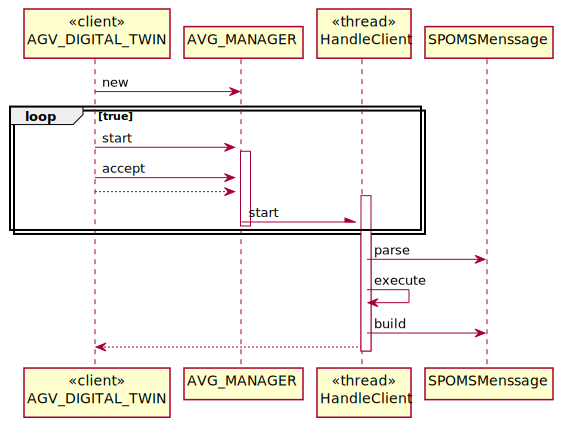

# US5002
=======================================
# AVG DiGITAL TWIN output communication module

## Requirements

As Project Manager, I want that the team start developing the output communication module of the AGV digital twin to update its status on the "AGVManager".

## Analysis

Based on the discussion with the customer, we gathered the following extra information on this feature:

This use case is necessary to interface with agvs that the warehouse has in certain places of the warehouse to collect products.

The AGV Digital Twin operate on a 24/7 time schedule.

The AGV Digital Twin is able to communicate using sockets.

It must be used the provided application protocol (SPOMS2022).

It is suggested the adoptiong of concurrent mechanisms (e.g. threads) and state sharing between these mechanisms.

In this sprint, for demonstration purposes, it is acceptable to mock processing some of the incoming requests to foster some output communication.

No new domain concepts are at play.

## Design

The main questions about this use case are:

- How to provide the remote capability?

- How does each party know each other, namely, how does the AVG MANAGER know about this service?

-It will be used the provided application protocol (SPOMS2022).

### Communication protocol

It must be used the provided application protocol (SPOMS2022).

| Field	     | Offset  (bytes) | Length (bytes) | Description                                                                                                                                                                                                                                                                                                                |
|------------|-----------------|----------------|----------------------------------------------------------------------------------------------------------------------------------------------------------------------------------------------------------------------------------------------------------------------------------------------------------------------------|
| VERSION    | 0               | 1              | SPOMSP message format version. This field is a single byte and shouldbe interpreted as an unsigned integer (0 to 255). The present message format version number is one.                                                                                                                                                   |
| CODE       | 1               | 1              | This field identifies the type of request or response. It should beinterpreted as an unsigned integer (0 to 255).                                                                                                                                                                                                          |
| D_LENGTH_1 | 2               | 1              | These two fields are used to specify the length in bytes of the DATAfield. Both these fields are to be interpreted as unsigned integer numbers (0 to 255). The length of the DATA field is to be calculated as follows: D_LENGTH_1 + 256 x D_LENGTH_2 The length of the DATA field may be zero, meaning it does not exist. |
| D_LENGTH_2 | 3               | 1              |                                                                                                                                                                                                                                                                                                                            |
| DATA       | 4               |                | Contains data to meet the specific needs of the participating applications.                                                                                                                                                                                                                                                |

The protocol will support some message types by defalut:
- COMMTEST
- DISCONN
- ACK

CODE 0 - MENSSAGE "COMMTEST" - Communications test request with no other effect on the server application than the response with a code two message (ACK). This request has no data.

CODE 1 - MENSSAGE "DISCONN" - End of session request. The server is supposed to respond with a code two message, afterwards both applications are expected to close the session (TCP connection). This request has no data.

CODE 2 - MENSSAGE "ACK" - Generic acknowledgment message. Used in response to requests with codes zero and one but may be used for other requests. This response has no data.

##Other Mensages

#### RECEPTION_AVG_ID

The RECEPTION_AVG_ID code 21 message has the following format:

    RECEPTION_AVG_ID, «avgID»

#### SEND_AVG_STATUS

The SEND_AVG_STATUS code 22 message has the following format

    SEND_AVG_STATUS, «avgID» , «status» 

Avg Status can be FREE or BUSY

#### SEND_TASK_COMPLETION

The SEND_TASK_COMPLETION code 23 message has the following format:

    SEND_TASK_COMPLETION, «avgID» /// «taskID» ///FINISH

### Use case realization

There are multiple responsibilities at play that need to be distributed among the different objects, namely:
- outbound message construction

Regarding the execution itself, we will reuse as much as possible the existing controller.

We won't use any framework (e.g., Spring Boot) for this and will leverage regular socket support in java (_mainly because we want to learn java sockets and multi-threading_).

The server must be resilient to badly formed input as well as abrupt connection closing from the client.

### Unit testing

N/A

### Manual testing

N/A