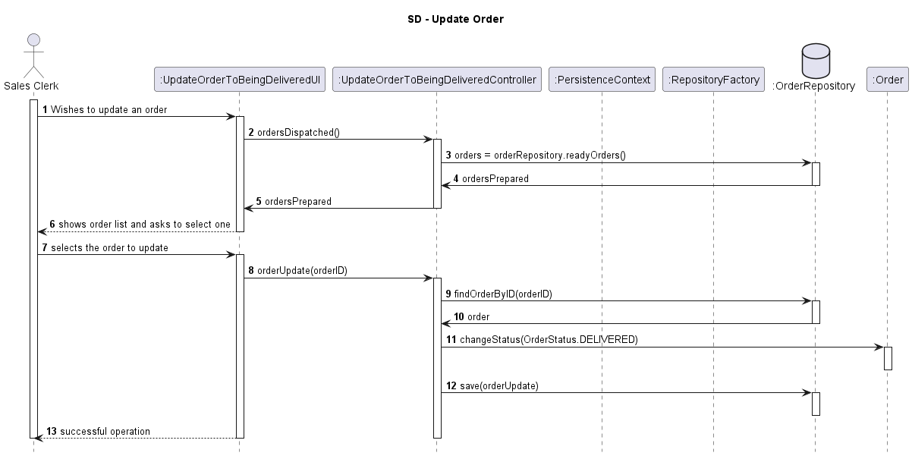

# US1006 - As Warehouse Employee , I want to access the list of orders that have already been prepared by the AGV's and be able to update any of those orders as having been dispatched for costumer delivery.
=======================================

# 1. Requisitos

**Demo1** Como Sales Clerk pretendo dar update ao status de uma order para sendo entregue.

A interpretação feita deste requisito foi no sentido de o Sales Clerk escolher por id de order de uma lista de orders a order que pretende dar update e o status desta order leva update para sendo entregue.

# 2. Análise

## 2.1. Diagrama de Sequência do Sistema

# 3. Design

## 3.1. Realização da Funcionalidade

## 3.2. Diagrama de Classes

## 3.3. Padrões Aplicados

## 3.4. Testes 

Nao foram realizados testes para esta US.

