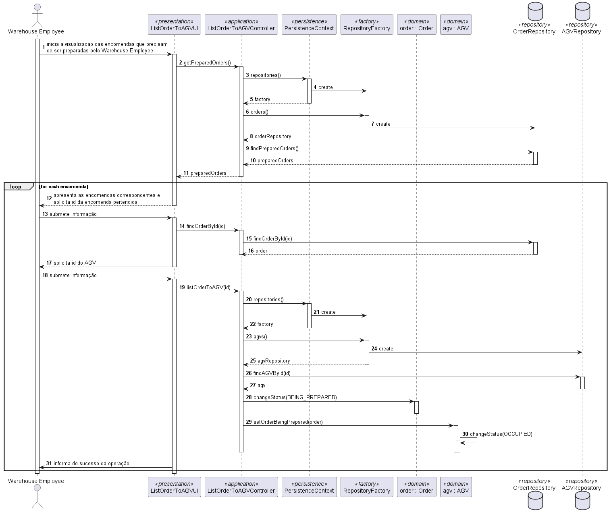

# US2003 - As Warehouse Employee, I want to access the list of orders that need to be prepared by an AGV and be able to ask/force any of those orders to be immediately prepared by an AGV available.
=================================

# 1. Requisitos

**Demo1** Como Customer pretendo criar uma order direcionada para um customer

A interpretação feita deste requisito foi no sentido de que o Warehouse Employee, após conseguir visualizar todas as encomendas disponíveis para serem tratadas, vai digitar os ids da encomenda e do AGV desejados de forma a colocar o AGV a preparar a encomenda.
## 1.1. Questões Relevantes no fórum

# 2. Análise

## 2.1. Diagrama de Sequência do Sistema

# 3. Design

## 3.1. Realização da Funcionalidade

## 3.2. Diagrama de Classes

## 3.3. Padrões Aplicados

## 3.4. Testes 

Nao foram realizados testes relativamente a este US

