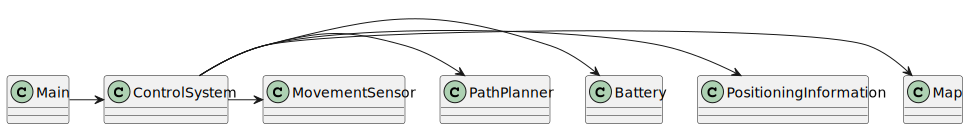
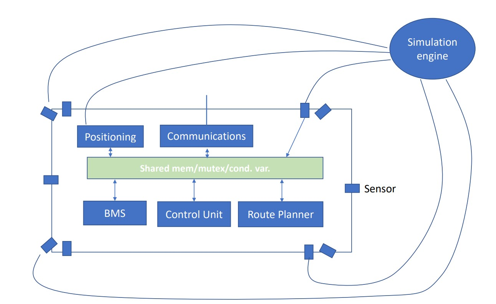

# US5100

# 1. Requisitos

**US5100**  As Project Manager, I want that the team to develop and integrate the others components/parts of the AGV digital twin (e.g.: movement, obstacle sensors, control unit).

- This user story should be planned in conformity with SCOMP guidelines.

# 2. Análise

*From the description of this user story, we know that:*

- It would be necessary to have the Json File's US completely implemented.

# 3. Design

## 3.1. Realização da Funcionalidade

## 3.2. Diagrama de Classes

## 3.3. Padrões Aplicados
*In order to develop this branch, we used a modular aproach regarding the movements and sensors of the AGV.

 
## 3.4. Testes 

n/a

# 4. Implementação

  In the Implementation segment, our team didn't complete all the requirements, since it only got to implement mostly the domain section without using the knowledge from the SCOMP subject regarding Threads.

# 5. Integração/Demonstração

N/A

# 6. Observações

