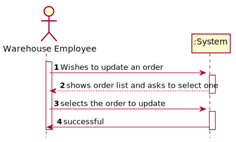
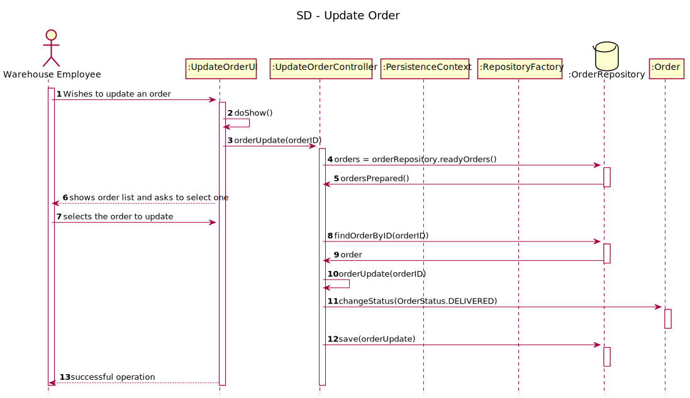
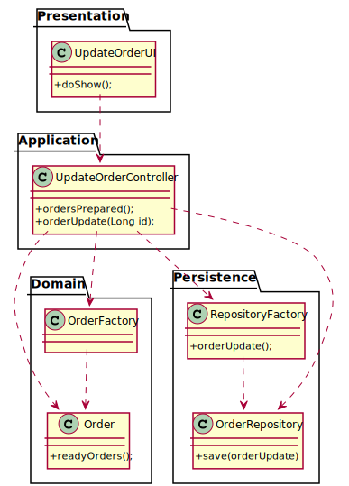

# US2004 - As Warehouse Employee , I want to access the list of orders that have already been prepared by the AGV's and be able to update any of those orders as having been dispatched for costumer delivery.
=======================================

# 1. Requisitos

**Demo1** Como Warehouse Employee pretendo dar update ao status de uma order para ja tendo sido entregue.

A interpretação feita deste requisito foi no sentido de o Warehouse Manager escolher por id de order de uma lista de orders a order que pretende dar update e o status desta order leva update para ja ter sido delivered.

# 2. Análise

## 2.1. Diagrama de Sequência do Sistema

# 3. Design

## 3.1. Realização da Funcionalidade

## 3.2. Diagrama de Classes

## 3.3. Padrões Aplicados

## 3.4. Testes 

Nao foram realizados testes para esta US.

