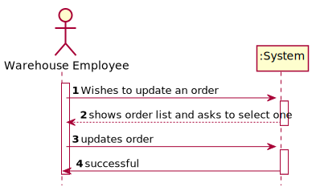
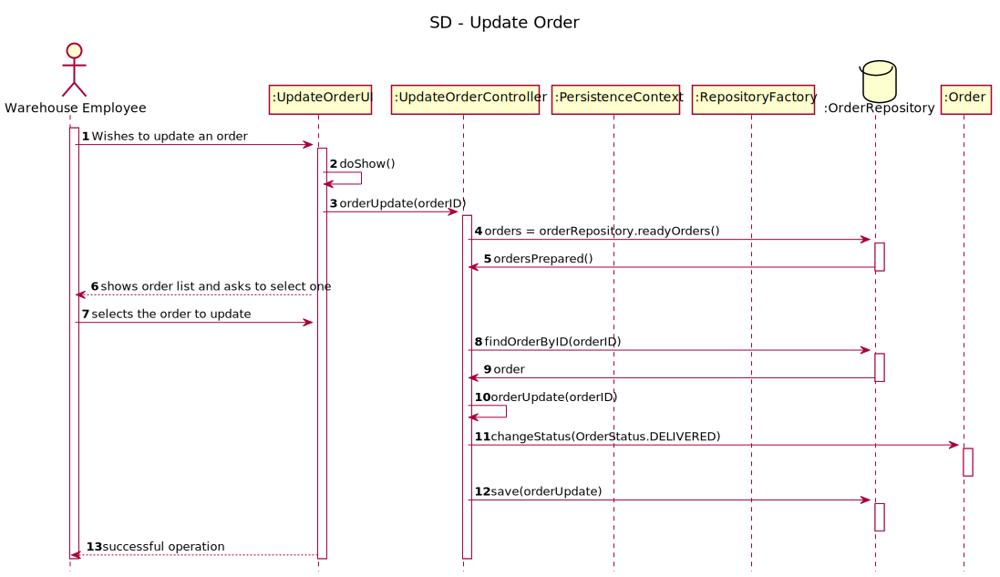
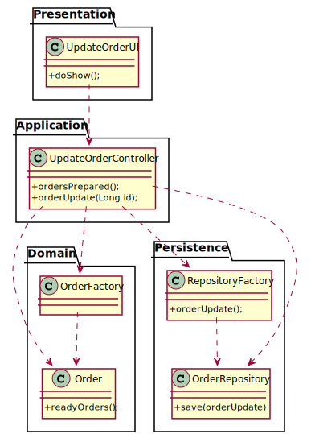

# US2004
=======================================

# 1. Requisitos

**US2004** As Warehouse Employee, I want to access the list of orders that have already been prepared by the AGVs and be able to update any of those orders as having been dispatched for customer delivery.

- US2004.1. Show list of orders ...

- US2004.2. Select order ...

- US2004.3. Update order ...

The interpretation made of this requirement was in the sense of creating a way to update the information of existing orders into the database.

# 2. Análise

*From the description of this user story, we know that:*

-Client basic information comprehends name,e-mail, billing address,postal address, birth date, phone number, vat and gender

-To promote integration with other information systems, a customer also has: a uniqueID

*Business Rules:*
- Name: at least a first and last name is required. Although, desirably the customer should specify his/her full name. Considering this, apply the min/max length you consider as reasonable to meet this requirement.
- VAT ID varies from one country to another. Usually it has letters and numbers (cf. here). The system must be prepared to support/recognize several VAT Ids.
- Phone number: according to international standards (e.g.: +351 934 563 123).
- Birthday: it is a date... you can adopt year/month/day.
- Address: Normal type of address ( Street name, door number, postal code, city, country )

# 3. Design

The way found to solve this problem was to create an UpdateOrderUI class that makes use of the
UpdateOrderController to create instances in order to guarantee the business rules given by the customer.

## 3.1. Realização da Funcionalidade

## 3.2. Diagrama de Classes

## 3.3. Padrões Aplicados
*Use the standard layer-based application framework*

        Domain Class: Order
        Controller: UpdateOrderController
        Repository: OrderRepository

## 3.4. Testes 
**Test 1:** Check that it is  possible to create an instance of the Customer class with all values.
**Test 2:** Check that it is not possible to create an instance of the Customer class with null values.

# 4. Implementação

N/A

# 5. Integração/Demonstração

This being the functionality defined with the highest priority, it was the one of the first ones to be implemented, so that, later, the other functionalities can be associated with it.

# 6. Observações

N/A

