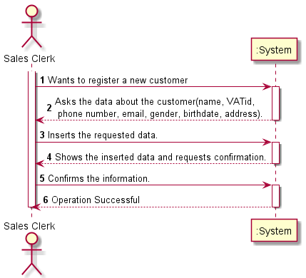
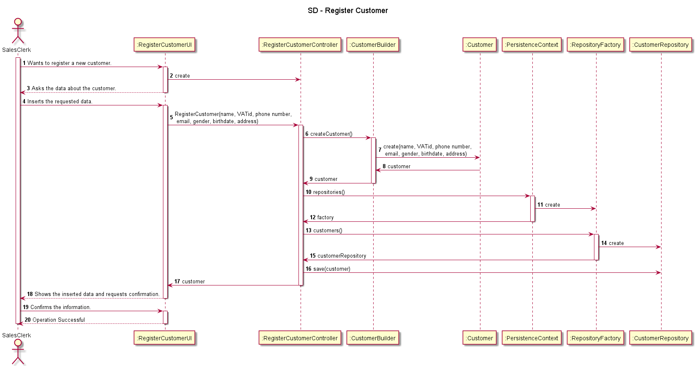
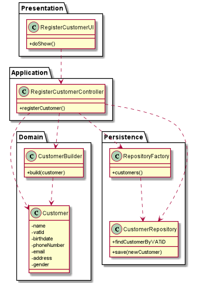

# US1003

# 1. Requirements engineering

### Brief format

The Sales Clerk wants to register a new customer.
The system asks for the data about the new customer (name, VATid, phone number, email, gender, birthdate, address).
The Sales Clerk inserts the requested data.
The system shows the inserted data and requests confirmation.
The Sales Clerk confirms.
The system display all the data about the customer and informs the Sales Clerk about the success of the operation.

## 1.1. Relevant questions on the forum

> Q: When creating a customer, should it be automatically associated with a login, that is, when entering its data, such as name, and so it is necessary to enter a username and a password? It says: "The registration is manually performed by a clerk. No account activation is required."
However then it also says this: "Create credential for a customer. At any time, clerks might request the system to generate access credentials to a given customer access the system. The generated credentials are sent by email to the customer and are never shown to the clerk."
Should these features be implemented together?
>
> A: There are two distinct scenarios here:
> * 1. The customer is registering him/herself in the system (cf. Use Case 3.1.4a). In this scenario, credentials are generated as soon as the account activation process is successfully completed.
> * 2. A clerk is registering customers either manually or by importing files (cf. Use Case 3.1.4b and 3.1.4c respectively). In this scenario no account activation process is required and/or performed. Moreover, by default, no customer credentials are to be generated. If such credentials are needed, the clerk undergoes on another use case (cf. Use Case 3.1.5). As you already figure it out, it is an excellent idea that at the end of use case 3.1.4b to ask the clerk if (s)he want to perform the use case 3.1.5.
>
>---
>
> Q: Dear Client, Which will be the format of the file that contains the information about the clients that will be imported? Should we support different formats (XML ,JSON ,CSV, etc)?
>
> A: Multiple formats should be supported. Details about each format and data structure will be provided just when requesting such feature (through a US).
>
>---
>
> Q: Dear Client, Considering the creation of new customers, we have this information."Regarding customers, the minimum required information is its name, a valid Value-Added Tax (VAT) identifier, an email address, and a phone number. Optionally, customers might state their birthdate and gender and have/manage several billing and delivering postal addresses (...)". Some questions arose as to which format each information should be in, namely:
> * Name - should we consider first name, last name or is there anything more worth capturing? Are there length restrictions? 
> * VAT id- which length should it have? Is it only digits or could there be letters?
> * Phone number: which lenght/format?
> * Birthday - in which format?
> * Address - What kind of format are we expecting for these? Street name, door number, postal code, city, country is a valid format or are we missing anything?
>
> A: I hope this information is helpful:
> * Name: at least a first and last name is required. Although, desirably the customer should specify his/her full name. Considering this, apply the min/max length you consider as reasonable to meet this requirement.
> * VAT ID varies from one country to another. Usually it has letters and numbers (cf. here). The system must be prepared to support/recognize several VAT Ids.
> * Phone number: according to international standards (e.g.: +351 934 563 123).
> * Birthday: it is a date... you can adopt year/month/day.
> * Address: I think you said it all.

# 2. OO Analysis

*Neste secção a equipa deve relatar o estudo/análise/comparação que fez com o intuito de tomar as melhores opções de design para a funcionalidade bem como aplicar diagramas/artefactos de análise adequados.*

*Recomenda-se que organize este conteúdo por subsecções.*

## Excerpt from the Relevant Domain Model for US

## 2.1. System Sequence Diagram

# 3. Design - User Story Realization

*Nesta secção a equipa deve descrever o design adotado para satisfazer a funcionalidade. Entre outros, a equipa deve apresentar diagrama(s) de realização da funcionalidade, diagrama(s) de classes, identificação de padrões aplicados e quais foram os principais testes especificados para validar a funcionalidade.*

*Para além das secções sugeridas, podem ser incluídas outras.*

## 3.1. Sequence Diagram

## 3.2. Class Diagram

## 3.3. Padrões Aplicados

*Nesta secção deve apresentar e explicar quais e como foram os padrões de design aplicados e as melhores práticas.*

## 3.4. Tests 
*Nesta secção deve sistematizar como os testes foram concebidos para permitir uma correta aferição da satisfação dos requisitos.*

**Teste 1:** Verificar que não é possível criar uma instância da classe Exemplo com valores nulos.

	@Test(expected = IllegalArgumentException.class)
		public void ensureNullIsNotAllowed() {
		Exemplo instance = new Exemplo(null, null);
	}

# 4. Implementação

*Nesta secção a equipa deve providenciar, se necessário, algumas evidências de que a implementação está em conformidade com o design efetuado. Para além disso, deve mencionar/descrever a existência de outros ficheiros (e.g. de configuração) relevantes e destacar commits relevantes;*

*Recomenda-se que organize este conteúdo por subsecções.*

# 5. Integração/Demonstração

*Nesta secção a equipa deve descrever os esforços realizados no sentido de integrar a funcionalidade desenvolvida com as restantes funcionalidades do sistema.*

# 6. Observações

*Nesta secção sugere-se que a equipa apresente uma perspetiva critica sobre o trabalho desenvolvido apontando, por exemplo, outras alternativas e ou trabalhos futuros relacionados.*

