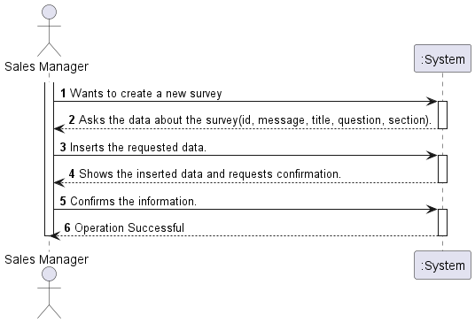

# US3001

# 1. Requirements engineering

### Brief format

The Sales Manager wants to create a new questionnaire to be further answered by customers.
The system asks for the data about the new questionnaire (id, message, title, question, section).
The Sales Manager inserts the requested data.
The system shows the inserted data and requests confirmation.
The Sales Manager confirms.
The system display all the data about the new questionnaire and informs the Sales Manager about the success of the operation.

## 1.1. Relevant questions on the forum

> Q: The User Story 3001  refers to the UC 3.3.1 -> "Create a new survey. A survey is characterized by an alphanumeric code, a description, the period( in days) it will be performed, the intended questionnaire, and a set of rules that allows the system to determine the survey target audience." But what are the constraints to the survey alphanumeric code and the description?
>
> A: Basic constraints:
>- Code: alphanumeric value with 15 chars max
>- Description: non-empty short sentence (e.g.: 40 chars).
>
>---
>
> Q: Can you specify / define what business rules are associated to Questionnaire, Section and Question? (Eg: Questionnaire ID only has 9 characters / follows an expression).
>
> A: Basic business rules related with Questionnaire, Section and Question are already available on the specifications document, namely on Table 1, 2 and 3. Teams must adopt common-sense when applying other criteria such as min/max chars length and support/explain the rationale taken.
>
>---
>
> Q: As I understand, the questionnaire will have to be created through the command-line interface of our application and then exported in order for it's grammar to be validated. 
> Is my interpretation correct? Can we export it to XML, for example, and validate it's grammar afterwards?
> 
> A: There is no need to import/export data. Both components should be integrated. I advice you to talk with technical experts (faculty of Lab classes of course units).

# 2. OO Analysis

*Neste secção a equipa deve relatar o estudo/análise/comparação que fez com o intuito de tomar as melhores opções de design para a funcionalidade bem como aplicar diagramas/artefactos de análise adequados.*

*Recomenda-se que organize este conteúdo por subsecções.*

## Excerpt from the Relevant Domain Model for US

## 2.1. System Sequence Diagram

# 3. Design - User Story Realization

*Nesta secção a equipa deve descrever o design adotado para satisfazer a funcionalidade. Entre outros, a equipa deve apresentar diagrama(s) de realização da funcionalidade, diagrama(s) de classes, identificação de padrões aplicados e quais foram os principais testes especificados para validar a funcionalidade.*

*Para além das secções sugeridas, podem ser incluídas outras.*

## 3.1. Sequence Diagram

## 3.2. Class Diagram

## 3.3. Padrões Aplicados

*Nesta secção deve apresentar e explicar quais e como foram os padrões de design aplicados e as melhores práticas.*

## 3.4. Tests 
*Nesta secção deve sistematizar como os testes foram concebidos para permitir uma correta aferição da satisfação dos requisitos.*

**Teste 1:** Verificar que não é possível criar uma instância da classe Exemplo com valores nulos.

	@Test(expected = IllegalArgumentException.class)
		public void ensureNullIsNotAllowed() {
		Exemplo instance = new Exemplo(null, null);
	}

# 4. Implementação

*Nesta secção a equipa deve providenciar, se necessário, algumas evidências de que a implementação está em conformidade com o design efetuado. Para além disso, deve mencionar/descrever a existência de outros ficheiros (e.g. de configuração) relevantes e destacar commits relevantes;*

*Recomenda-se que organize este conteúdo por subsecções.*

# 5. Integração/Demonstração

*Nesta secção a equipa deve descrever os esforços realizados no sentido de integrar a funcionalidade desenvolvida com as restantes funcionalidades do sistema.*

# 6. Observações

*Nesta secção sugere-se que a equipa apresente uma perspetiva critica sobre o trabalho desenvolvido apontando, por exemplo, outras alternativas e ou trabalhos futuros relacionados.*

