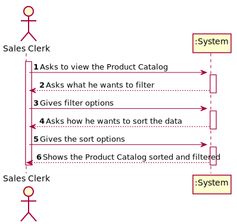
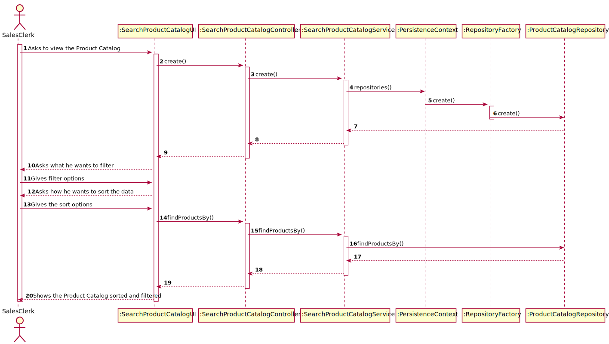
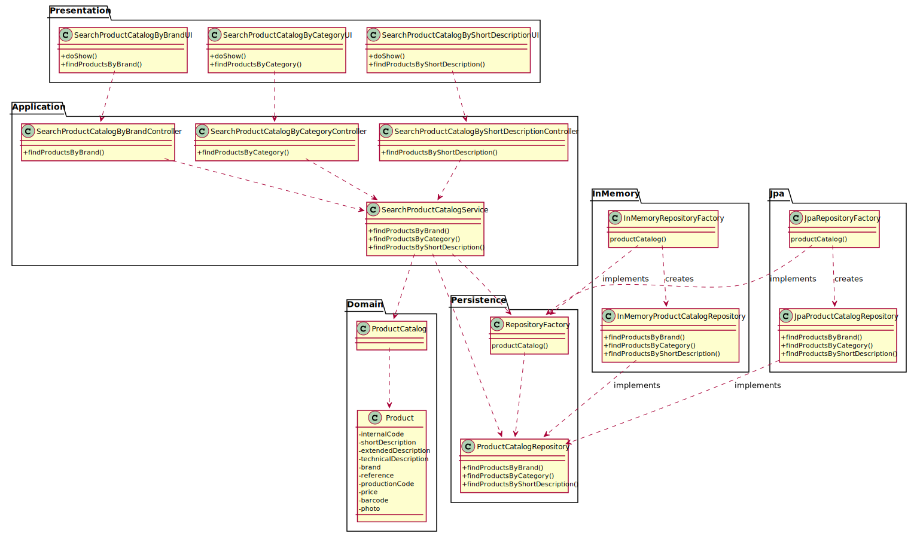

# US1002 - As Sales Clerk, I want to view/search the products catalog.

Developed by: [**1200616**](../ListaFuncionalidadesEstudante.md)

# 1. Requisitos

*Nesta secção a equipa deve indicar a funcionalidade desenvolvida bem como descrever a sua interpretação sobre a mesma e sua correlação e/ou dependência de/com outros requisitos.*

*Exemplo*

**Demo1** Como Sales Clerk pretendo...

- Demo1.1. Filtrar o 'Product Catalog' por 'Brand'

- Demo1.2. Filtrar o 'Product Catalog' por 'Category'

- Demo1.3. Filtrar o 'Product Catalog' por 'Short Description'

**Demo2** Como Sales Clerk pretendo...

- Demo2.1. Ordenar os resultados por 'Internal Code'

- Demo2.2. Ordenar os resultados por 'Brand'

- Demo2.3. Ordenar os resultados por 'Category'

- Demo2.4. Ordenar os resultados por 'Unit Price'

A interpretação feita deste requisito foi no sentido de que o Sales Clerk precisa de uma opção para ver o catálogo de produtos e nela pode especificar como quer filtrar a pesquisa e também como quer ordenar os resultados.
Não há nenhuma dependencia para além de ser preciso haver dados no catálogo de produtos para podes testar a pesquisa.

## 1.1. Questões Relevantes no fórum

> Q: Should the sales clerk select/specify the catalog presentation order before he/she can see the catalog? Or the catalog is presented in a default order, and then if the sales clerk wants, he/she can change it? The same doubt came on the filtering.
>
> A: Data to be used to filter the products catalog content should be asked ahead.
>
>---
>
> Q: Talking about data presentation orders, which ones should exist?
>
> A: Regarding presentation order, the necessary data can be asked either: ahead and after presenting them.
>
>---
>
> Q: Regarding the product search, is there a field you want to use to filter the data and any desired data presentation order? And do you want to see all the fields or just a simplified summary?
>
> A: Commonly fields used to filter products are:
>* Category
>* Description (any of the available descriptions)
>* Brand
>
> User should select/specify a data presentation order. This applies to any similar US.
>
>At least the product' code, short description, brand, category and unit price should be presented.
>
>More details can be presented for a given/selected product at user request.
>

# 2. Análise

*Neste secção a equipa deve relatar o estudo/análise/comparação que fez com o intuito de tomar as melhores opções de design para a funcionalidade bem como aplicar diagramas/artefactos de análise adequados.*

*Recomenda-se que organize este conteúdo por subsecções.*

## 2.1. Diagrama de Sequência do Sistema

# 3. Design

*Nesta secção a equipa deve descrever o design adotado para satisfazer a funcionalidade. Entre outros, a equipa deve apresentar diagrama(s) de realização da funcionalidade, diagrama(s) de classes, identificação de padrões aplicados e quais foram os principais testes especificados para validar a funcionalidade.*

*Para além das secções sugeridas, podem ser incluídas outras.*

## 3.1. Realização da Funcionalidade

## 3.2. Diagrama de Classes

## 3.3. Padrões Aplicados

*Nesta secção deve apresentar e explicar quais e como foram os padrões de design aplicados e as melhores práticas.*

## 3.4. Testes 
*Nesta secção deve sistematizar como os testes foram concebidos para permitir uma correta aferição da satisfação dos requisitos.*

**Teste 1:** Verificar que não é possível criar uma instância da classe Exemplo com valores nulos.

	@Test(expected = IllegalArgumentException.class)
		public void ensureNullIsNotAllowed() {
		Exemplo instance = new Exemplo(null, null);
	}

# 4. Implementação

*Nesta secção a equipa deve providenciar, se necessário, algumas evidências de que a implementação está em conformidade com o design efetuado. Para além disso, deve mencionar/descrever a existência de outros ficheiros (e.g. de configuração) relevantes e destacar commits relevantes;*

*Recomenda-se que organize este conteúdo por subsecções.*

# 5. Integração/Demonstração

*Nesta secção a equipa deve descrever os esforços realizados no sentido de integrar a funcionalidade desenvolvida com as restantes funcionalidades do sistema.*

# 6. Observações

*Nesta secção sugere-se que a equipa apresente uma perspetiva critica sobre o trabalho desenvolvido apontando, por exemplo, outras alternativas e ou trabalhos futuros relacionados.*

