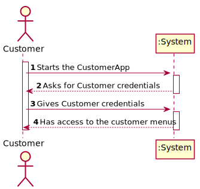

# US1901 - As Project Manager, I want that the "OrdersServer" component supports properly, at request, the needs of the "CustomerApp" application.
=================================

# 1. Requisitos

*Nesta secção a equipa deve indicar a funcionalidade desenvolvida bem como descrever a sua interpretação sobre a mesma e sua correlação e/ou dependência de/com outros requisitos.*

*Exemplo*

**Demo1** Como Project Manager pretendo...

- Demo1.1. que o "OrdersServer" suporte as necessidade de ver o product catalog e adicionar um produto ao shopping cart.

- Demo1.1. que o "OrdersServer" suporte as necessidade de ver o estado atual de uma order.

## 1.1. Questões Relevantes no fórum

> Q: Regarding the USs 1901,4001, 5001, and 5002, what would you consider its complete state, that is, what would be the criterion to define whether or not this US is functional?
>
> A: For all of those US, the communication between the two involved components must be implemented in accordance with the SPOMS2022. The requests processing can be somehow mocked. For instance, if processing a request implies saving some data to the database, the component can instead write such data to a log (mocking). Latter, on next sprint, the teams implement the interaction to the database.
>

# 2. Análise

*Neste secção a equipa deve relatar o estudo/análise/comparação que fez com o intuito de tomar as melhores opções de design para a funcionalidade bem como aplicar diagramas/artefactos de análise adequados.*

*Recomenda-se que organize este conteúdo por subsecções.*

## 2.1. Diagrama de Sequência do Sistema

# 3. Design

*Nesta secção a equipa deve descrever o design adotado para satisfazer a funcionalidade. Entre outros, a equipa deve apresentar diagrama(s) de realização da funcionalidade, diagrama(s) de classes, identificação de padrões aplicados e quais foram os principais testes especificados para validar a funcionalidade.*

*Para além das secções sugeridas, podem ser incluídas outras.*

## 3.1. Realização de funcionalidades

Não foi implementada a parte do customer dar login.

## 3.2. Padrões Aplicados

*Nesta secção deve apresentar e explicar quais e como foram os padrões de design aplicados e as melhores práticas.*

## 3.3. Fluxo de troca de mensagens ##

1. **Abre** o Socket.
2. **Espera** pela mensagem do **Cliente** com o **Código de Teste (0)**.
3. **Manda** ao **Cliente** o **Código de Entendido (2)**.
4. **Espera** pela mensagem do **Cliente** com o **Customer** que está **logado**.
5. **Manda** informação de acordo com a opção :
    -se a opção for 1 então o **Customer** acede ao product catalog e pode adicionar um produto ao shopping cart.

    -se a opção for 2 então o **Customer** pode ver o estado atual de uma order.

6. **Espera** pela mensagem do **Cliente** com o **Código de Fim (9)**.
7. **Manda** ao **Cliente** o **Código de Entendido (2)**.
8. **Fecha** o Socket.

## 3.4. Testes 
*Nesta secção deve sistematizar como os testes foram concebidos para permitir uma correta aferição da satisfação dos requisitos.*

**Teste 1:** Verificar que não é possível criar uma instância da classe Exemplo com valores nulos.

	@Test(expected = IllegalArgumentException.class)
		public void ensureNullIsNotAllowed() {
		Exemplo instance = new Exemplo(null, null);
	}

# 4. Implementação

*Nesta secção a equipa deve providenciar, se necessário, algumas evidências de que a implementação está em conformidade com o design efetuado. Para além disso, deve mencionar/descrever a existência de outros ficheiros (e.g. de configuração) relevantes e destacar commits relevantes;*

*Recomenda-se que organize este conteúdo por subsecções.*

# 5. Integração/Demonstração

Para demonstrar o servidor usaremos um PC como server e varios outros PC's como clients a aceder ao mesmo tempo. Logo não há um IP especifico.
Precisaremos das User Stories 1004 e 1501 funcionais para efeitos de demonstração. 

# 6. Observações

*Nesta secção sugere-se que a equipa apresente uma perspetiva critica sobre o trabalho desenvolvido apontando, por exemplo, outras alternativas e ou trabalhos futuros relacionados.*

